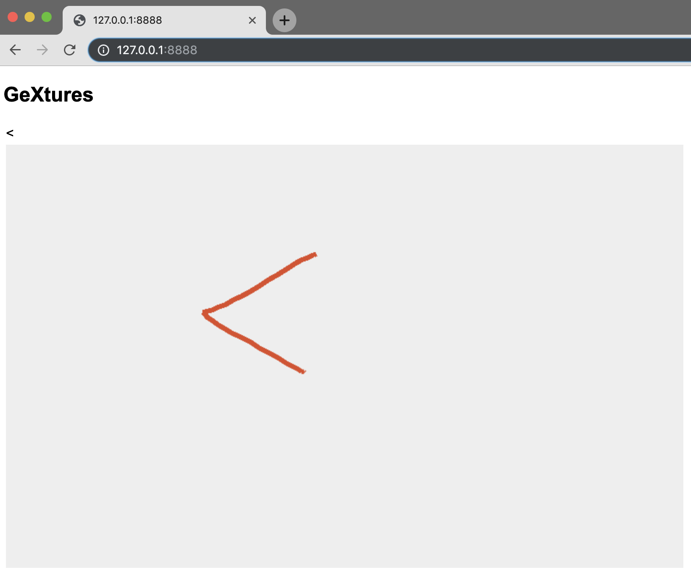

# GeXtures -- eXplainable Gestures
GeXtures is a testbed for exploring how we can design stroke-based gesture recognizers that can explain how they work.

## How to run
After downloading or cloning the repo:
```shell
cd gextures-master
chmod 755 serverup
./serverup 8888
```
(If you use Pythong 3 or later versions, you might have trouble running ```serverup```. For this specific project, you can alternatively open the ```index.html``` file in your browser to run the app.)

Open a browser (preferrably with a debugger), and navigate to http://127.0.0.1:8888.


